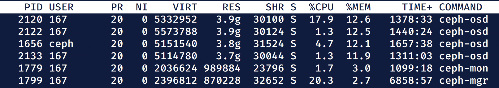

## Hardware Considerations

Like with most Home Lab setups, a lot of success can be tied to having the right hardware for the job. The hard part is finding the right balance. It's tempting to pick up corporate cast offs of data center servers for pennies on the dollar, but that stuff is built to be in a data center, not in a house. While I like having a small rack for my gear, except for the Cisco switch, it's all shelves. And when it comes to compute hardware, I'm a huge fan of both Intel NUCs and Raspberry Pis. For Ceph, I tilt to only using NUCs for the server side components. RPis work fine for clients, and might be fine for some of the individual components like Ceph Manager or Ceph Monitor, but the OSDs are going to benefit from both fast CPUs and lots of RAM. Once an OSD system is sized for a large Home Lab environment, chances are you're looking at a NUC (or equivalent) with 16GB, 32GB, or even 64GB RAM. At that point there's zero reason to not make the Manager and Monitor processes be coresident on the OSD systems. 

In my case, I'm using three [NUC7i3BNH](https://www.intel.com/content/www/us/en/products/boards-kits/nuc/kits/nuc7i3bnh.html) systems. The `i3` is more than enough CPU, and runs fairly cool. The "tall" NUC varient is useful since a large SSD can be housed within the unit separate from M.2 storage. I put the OS on the M.2 storage, and then dedicated the SSD to Ceph as an OSD. There is a 2TB SSD in each NUC, along with a [Yottamaster 5 Bay enclosure](https://amzn.to/32FOiRn) with three 12TB IronWolf HDDs. Since I leave the replication setting at the default of `replicas=3` my overall usable capacity is 38TB, though I split the SSDs and HDDs into different pools. It's at these capacities that the OSD RAM requirements start to become important. Here's a snap of the resource usage of one of my Ceph servers. The CPU usage comes from an OSD scrub being in progress at the time of the screenshot. 

The NUC has 32GB of RAM, and 17GB is in use with 12GB being used as file cache. That's the current running state, but how to get there?

## Installation

The method of installing Ceph has changed dramatically with the `Octopus v15` [release](https://ceph.readthedocs.io/en/latest/releases/octopus/#v15-2-4-octopus). Before Octopus, each Ceph server was configured to use an upstream repo, a collection of packages were installed (usually via a meta-package, as is commonly done), and `ceph-deploy` was used to push configs to the Ceph servers.  In my experience this worked decently well, although I can see how it must have been a complete mess to keep up different Linux distributions, `systemd` setups, maybe no `systemd` at all, et al. With the Octopus release, things shifted to a Docker based system and a new tool, `cephadm`. Packages are still built and made available, but they aren't technically needed anymore.

Since this is a Home Lab environment, I consider every Ceph server to be a unit for all respective Ceph services. In a data center environment it might make more sense to place Ceph monitor, manager, MDS, OSD, and RGW services on different hardware. For the Home Lab putting them all on single boxes is fine, which also simplifies the management assuming there are at least three systems to work with. 

### Prep

Before setting up a cluster, make sure that each system that will be a Ceph server has Docker installed, and has an NTP client of some kind keeping the clock synchronized, and `cephadm` installed. The other important piece is to have SSH key authentication set up for the `root` account on all the systems. This part is likely to make security sensitive folks a bit nervous. In my case, I used one of the Ceph servers as the `cephadm` system, and ran it via the `root` account. If that account gets compromised then I'm already in deep trouble, so having it able to SSH to the other Ceph servers is less of an additional issue in my estimation. While it's not explicitly mentioned, I also add each system's short name with its IP address to all the Ceph servers' `/etc/hosts` file. DHCP reservation and DNS is fine, until it's not. 

There are multiple ways to get `cephadm` installed. Since packages are still being built, you can add the Ceph repo and install it via package management. It can also be [downloaded directly](https://github.com/ceph/ceph/tree/master/src/cephadm) and put into your PATH since fundamentally it's just a Python script. If you take that approach, be prepared to install some Python packages to meet dependencies. Myself, I just use the package method. I also find it useful to install the `ceph-common` package since that will also pull in RBD and CephFS support packages. 

### Bootstrap

The first thing to do is to bootstrap the cluster.

`cephadm bootstrap --mon-ip $HOST_IP`

Make sure to use the the IP address of the system, and _not_ `127.0.0.1`. Instead of specifying the IP, putting in the short name of the host might work, assuming it has been entered into the `hosts` file. 

The bootstrap operation should fire up a monitor and manager process via Docker. The progress of that can be viewed either by looking directly at Docker (`docker ps`) or via `ceph orch ps`. Once those processes are running, the next step is to add the other Ceph servers. 

### Add More Hosts

After the bootstrap, the `ceph` command can be used for almost everything. To make sure things are in a functional state, run `ceph -s` (which is the same as `ceph status` but with fewer characters to type). 

To add the other hosts, just run 

`ceph orch host add $HOSTNAME`

This operation will also start up monitors on those hosts. I think it will also set up managers. At the end of this process you technically have a Ceph cluster up and running. Without any actual storage Ceph is not very useful, however. So the next step is to add some OSDs.

### Add Storage

Basically each OSD corresponds to a host and a block device. In my case I have three Ceph servers, and since I use the default `replicas=3` setting, each Ceph server has the same number of block devices attached to them. This is not a requirement, but I find it simplifies things. By default Ceph will attempt to distribute blocks across hosts first, and drives second. I also try to keep the size of the drives the same across all the servers, but that's more to simplify things on my part than anything else. 

While Ceph can use partitions, it's strongly recommended to provide a full block device. Basically it uses LVM to claim the device (think `pvcreate`), and then sets up a custom storage layout called [Bluestore](https://ceph.io/community/new-luminous-bluestore/). It allows Ceph to embed a RocksDB system onto the device and then directly use the rest of the raw storage. There are performance tunings that can be done to Bluestore, but for a Home Lab environment I stick with the defaults. To prep a drive, I like to zero out the front of the device (`dd if=/dev/zero of=/dev/sda` for 30 seconds or so) followed by a reboot. Once the drives are prepped, they can be added as OSDs to the Ceph cluster. 

**WARNING! Be _VERY_ careful to make sure you target the correct drives!! This is a _DESTRUCTIVE_ process!!**

The syntax is simple, in that you instruct Ceph to add an OSD daemon on a particular host and with a particular block device.

`ceph orch daemon add osd $HOSTNAME:$DEVICE`

where `$DEVICE` is a path like `/dev/sda`. 

Using `ceph orch ps` the OSD processes should be visible as running containers, and a `ceph osd df` should show a list of OSDs along with their raw sizes, usages, and status. Looking at `ceph osd tree` can also be useful to quickly see which OSDs are attached to which hosts and their status. 

Now that there's a Ceph cluster, and it has some raw storage to work with, it's time to make a pool!

### Pool Time

A Ceph pool is a construct that provides a logical boundary for storage use. Every Ceph pool is able to use the raw storable available to the Ceph cluster, but each pool can have additional configuration for how that storage is to be used. For example, a pool can be defined to use a particular storage class, such as HDDs or SDDs, have quotas applied, and be configured to be used for RBD images or CephFS. 

Since I primarily use Ceph for Kubernetes storage, and have SSDs and HDDs available, I have two RBD pools specifically for Kubernetes usage. The SSD backed pool is named `k8s-fast` and the HDD backed pool is named `k8s-bulk`. These pool names get referenced in the Kubernetes StorageClass configurations.

Pool creation is technically an OSD operation since pools can only exist if there are OSDs available. 

`ceph osd pool create $NAME`

That will cause a pool to be created with default configurations, which includes having `replicas=3`. If you only have OSDs on two Ceph servers, then be prepared for `ceph -s` to show a health warning about a pool being in a degraded state. It will still be functional, but not until an OSD on a third host is available will it be healthy. Also, after creating a pool, a warning will appear if you don't assign it an "application". What is meant by that is whether the pool will be used for RBD images, CephFS, or RGW object storage. 

`ceph osd pool application enable $NAME $APPLICATION_NAME`

 

