Many years ago I decided to start a [Home Lab](/tags/homelab) with a collection of NUCs. At the time I was interested in brushing up my VMware skills, so I did the [VMUG Advantage](https://www.vmug.com/membership/vmug-advantage-membership) thing (which is a great deal, BTW) and ran a vSphere cluster. [As the usefulness of VMware waned for me I transformed it into a Kubernetes cluster.](https://skj.dev/a-tale-of-two-home-labs/) I fully acknowledge how silly that may seem, but I tend to learn best by doing, which really means “by breaking”. It’s nice to be able to break stuff within the comfort of one’s home. 😎

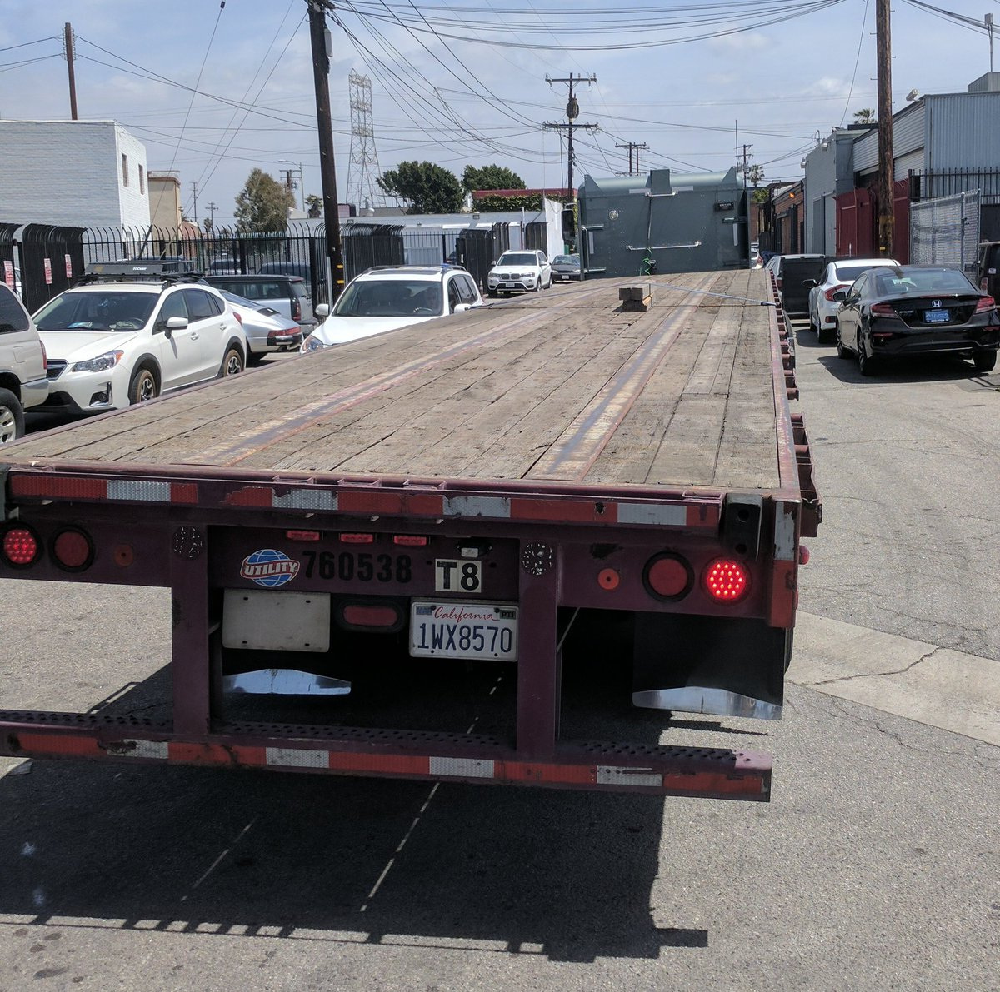

After multiple iterations of setting up Kubernetes I finally settled on using a combination of NUCs and Gen4 Raspberry Pis. ( More hardware details can be found in the [Hardware section of my Wiki](https://skj.wiki/books/home-lab/chapter/hardware). ) Three of the NUCs are K8s masters and Ceph servers. Of those, two are Ceph OSD servers, and have a `ceph-osd` taint applied so only Pods that are configured to tolerate the taint get scheduled to them. This has less to do with CPU and more to do with RAM. Since I have some large HDDs attached the OSD servers I wanted to make sure the bulk of RAM is available to Ceph. Also, I’m running Ceph directly on the NUCs, not inside of K8s (i.e. I’m not using [Rook](https://rook.io)). The third Ceph server is only running `ceph-mon` and `ceph-mgr`, so is mostly only an arbiter for the other two Ceph servers. Since I remove the master taint, the third NUC is also able to function as a worker node. The fourth NUC and all the RasberryPis are K8s worker nodes. Once I got settled into a stable configuration, `Home Lab v1` looked like this:

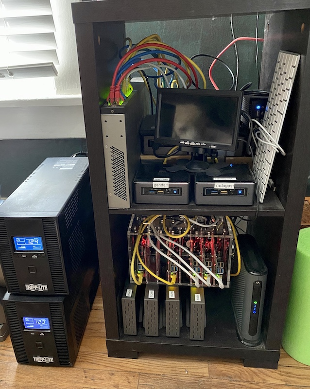

This thing was sitting in our bedroom since that’s where the coax for the Internet connection was setup. The house itself was built in 1920, so there isn’t any real closet space to put things like a Home Lab. Sometime in the 1950s the house was added onto. In the back bedroom that serves as my “office” there is a cubby closet of sorts, which started out as a “catch all” location for “stuff”. It sits above a stairwell that goes down to a partial basement, and at some point in the distant past the drywall on one side was damaged and covered up with cardboard and tape.

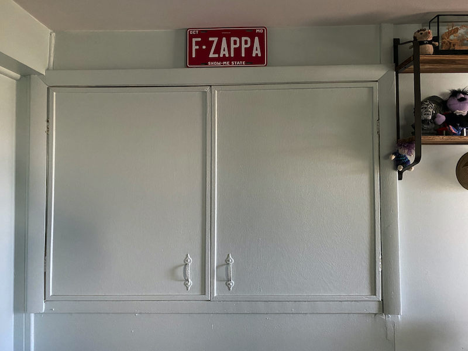

After some design contemplation I decided that the cubby could work. I would need to repair the side wall, have power run to it, and install a couple fan arrays to create a cross breeze. The larger space also meant I could use an actual rack. The majority of my gear would just sit on shelves, but that is still significantly better from a structural point of view than any kind of “closet” style shelving. And it can also hold rack mountable gear. With a clear design sketched out, I started with taking out the damaged drywall.

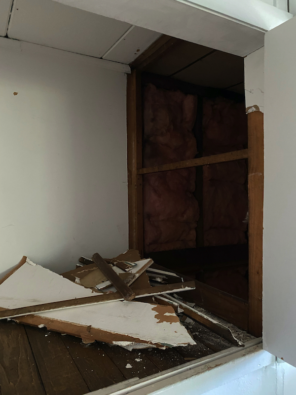

##  Air Flow

The left hand wall of the cubby is where the newer construction of the house attaches to the original construction. As a side effect, there is a channel that runs down to the basement on that side. Since that is where the cooler air will be, I decided to put the intake fan on the left, and exhaust fan on the right. The top of the stairs going down to the basement will stay a little warmer, but it should prevent any warm air recirculation.

When it came to finding some fans, I settled on the AC Infinity [T9](https://amzn.to/2QtVRWa) and [S9](https://amzn.to/3a4iacP) models. The T9 is really just the S9 with a bundled thermostat controller, which is a little cheaper as a bundle than as separates. Both units have three fans, and the thermostat controller can power both sets. While there is an option to adjust speed based on temperature, I leave both fans running at full speed. It’s possible I’ll need to rethink the cooling once summer arrives, but I’m hopeful it won’t be an issue.

The intake fan was mounted vertically since I had no interest in trying to cut through studs.

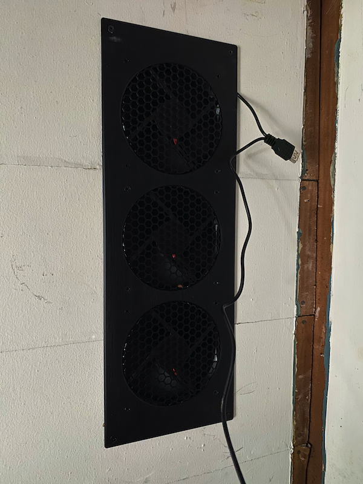

I got a piece of drywall cut and placed, having precut the hole for the exhaust fan.

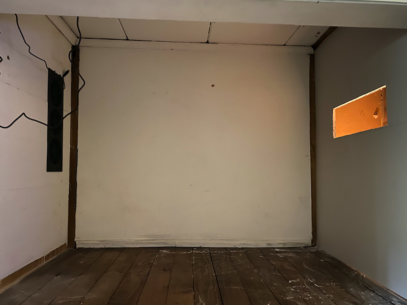

The AC Infinity fan assemblies are easily reversible, which I needed to do for the exhaust fans.

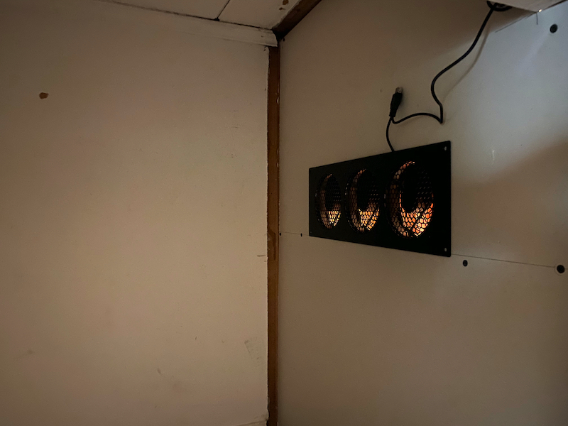

I cut a hole for the thermostat above the cubby doors, and that piece was all done. With nothing creating any heat in the cubby, the fans were able to quickly drop the temperature to something quite comfortable.

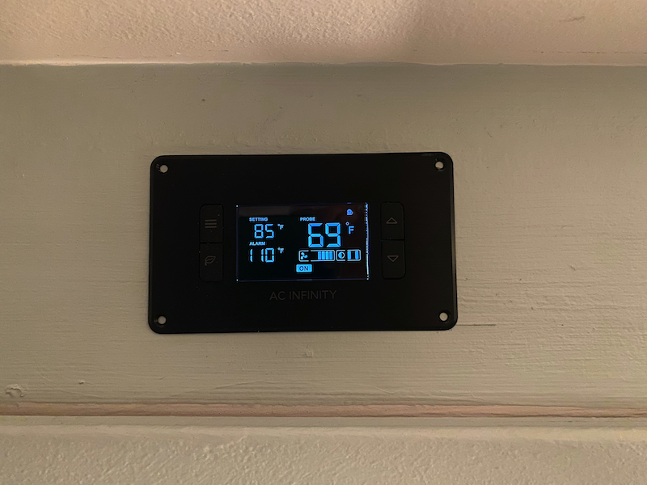

The next part involved having an electrician come out and run two dedicated circuits. Since I’ll be starting out with two UPSes and will very likely be adding a third, I didn’t want to pile everything up on a single breaker.

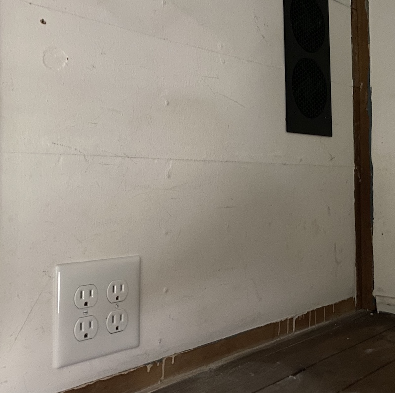

##  Wired Ethernet

One of the other reasons I wanted to move the Home Lab was to have a permanent location that I could run Ethernet cabling to. WiFi is great and all, but nothing beats wired networking. It also opens up the possibility to have PoE available anywhere a cable can be run. While the vast majority of my PoE gear is coresident with the rest of the Home Lab gear, it’s great to have the option anywhere.

The PoE component along with the additional ports needed for the various house runs pushed me to look at replacing my 20 port (non-PoE) switch. I have an 8 port PoE Netgear switch, but I wanted to avoid switch uplinks. Typically larger PoE switches are also expensive. The need for more than 8 PoE ports just isn’t something that comes up that often in the consumer space I suppose.

A long time ago I would frequent eBay for used computer gear, and returned there after seeing the cost of 48 port PoE switches. Enterprises regularly rotate their gear on three to four year cycles, and much of that equipment is still in excellent working condition when it gets surplussed. This is especially true of Cisco gear. It didn’t take very long for me to settle on a [Cisco 2960S-48FPS-L Switch](https://www.ebay.com/itm/302799763012), and at roughly $100 it was significantly cheaper than anything I would find in the consumer space.

With the switch on its way, I also ordered a [spool of CAT6 cable](https://amzn.to/3b8HTks), [a patch plate](https://amzn.to/2QutHua), [keystone jacks](https://amzn.to/3bbXFes), and some wall plates. Armed with a fish wire and a [punch down tool](https://amzn.to/3a7bUkv), I went about running cables.

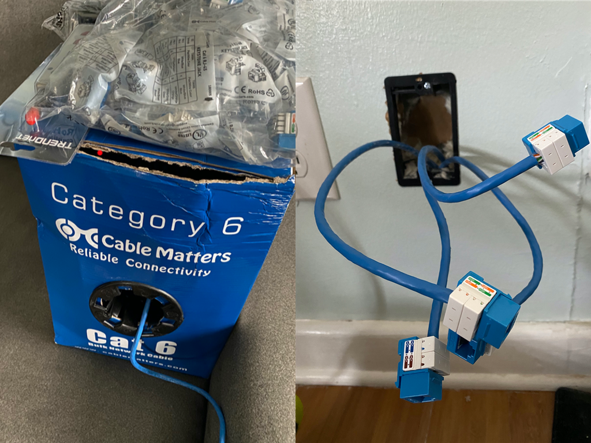
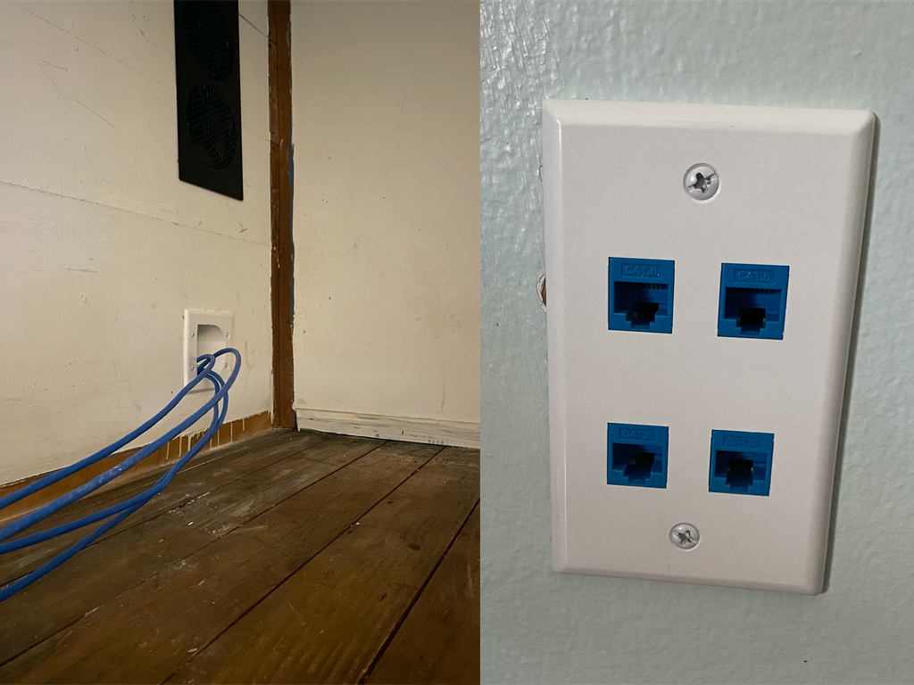

Since I went with a 48 port switch, I decided to run 4 lines everywhere I decide to put wall jacks. I would rather have some jacks that don’t get used instead of needing to run more lines after the fact.

##  Rack And Stack

Finding a suitable rack was harder than I had anticipated. The majority of offerings assume either a wall mount or something with doors that sits in a room. Neither of those things would work for me. Ultimately I found the [EchoGear 15U Open Frame Rack](https://amzn.to/2J2ku8a). An 18U frame would have been a perfect height, but the only other option was 20U, which was too tall. The EchoGear comes with two shelves, and I ordered [an extra](https://amzn.to/2UiD2GF) as the majority of my gear is not rack mountable.

I was impressed by the sturdiness of the rack, and after a bit of fiddling with getting it level, it settled into its permanent home in the cubby.

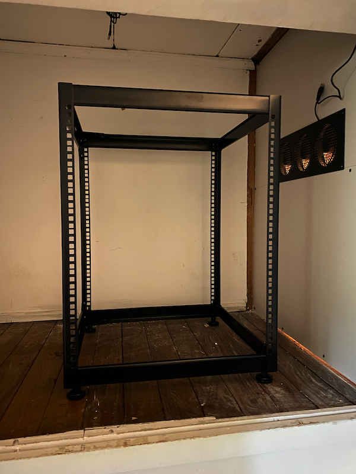

I decided to put the patch plate and switch at the bottom of the rack. Though there’s no way I’d run 48 ethernet cables to the cubby, I got a 48 port patch plate anyway. That way I could map the patch and switch port numbers directly. It only cost 1U of space, and for me was well worth it. Getting a patch plate instead of a patch panel was also important, since access to the backside of the rack really isn’t possible. Punching down wires into a keystone jack and then snapping it in to the plate by snaking my arm around isn’t exactly fun, but it’s doable.

On the first shelf I put the Raspberry Pis and pfSense box. Since the pfSense box is fanless I got a single AC Infinity S3 fan. It has little rubber feet, and sits comfortably on the system’s heatsink top. While it wasn’t overheating, the little $13 fan did drop the system temperature by roughly 20 degrees. Sitting next to the [Raspberry Pi Case](https://amzn.to/3de2R3f) puts it into a bit of a dead air space.

The next shelf up was for storage. I wanted to make sure that there was enough room for a third disk array for when I end up adding new nodes. At first I was a little concerned about sitting the NUCs on top of their respective disk arrays. The enclosures have a large fan in the back, and I left off the face plate to help with air flow. There ended up being no difference in temperature whether they sat on the top shelf or on top of their disk array.

The top shelf was for the remainder of the NUCs, which at this time is just two. My intention is to get a couple SFF builds put together sometime next year. At that time, those will go on the top shelf. The `gandalf` NUC will become a Ceph OSD server and join `durin` and `thorin` on the second shelf with a disk array of its own. It was a full weekend of effort, but in the end I was extremely happy with the results.

Under moderate load, the NUC CPU temps hover around 60°C. If things don’t go much over 70°C during the summer I’ll be happy. The immediate fix to the cubby being too hot during the summer will be to just open one of the doors. The biggest downside is it’s rather noisy in there. I have a handful of other ideas that I will noodle over if it becomes a problem, but I want to see how things shake out first.
