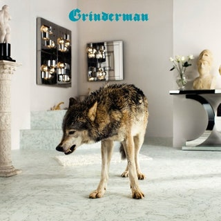
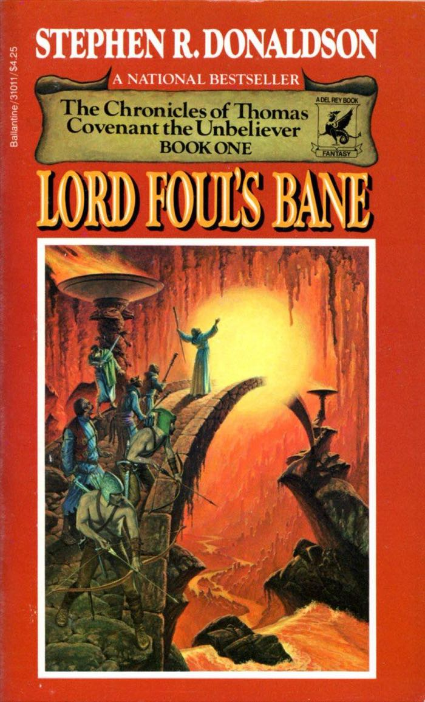
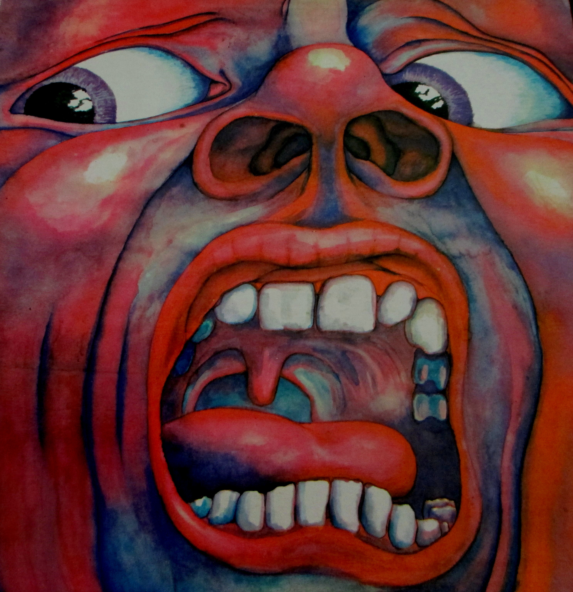

I don’t remember when I first stumbled across `Nick Cave`, but I know it was in the context of the second (and final) `Grinderman` album.

While I don’t necessarily choose albums or books based on cover art, it’s a little scary how much it drives my initial interest. Well, maybe the scariest part is how often cover art interest maps to my enjoyment of the corresponding content. When I was in grade school I remember seeing an intriguing cover in a book store, and immediately snatched up the book. One of the best parts of visiting the grandparents on my mother’s side was my grandmother would take me to the bookstore and let me get whatever I wanted. It was on such an occasion that I picked up `Lord Foul's Bane`, based entirely on its cover. I mean, between this cover and the title how could any ten year old resist!

I’m pretty sure I was staying with my grandparents for a weekend, and I burned through that book on the first day. My grandmother carted me off to the bookstore the next day, and I picked up the next two in the series, completing the trilogy. For those unfamiliar, it’s a fantasy series where the unlikely hero, `Thomas Covenant`, is a person who happens to have leprosy. Through turns of strange and magical events he is transported to and from a fantastical world where he is a wielder of great power. Again, how could any ten year old resist!

As a grade schooler I had somehow already been exposed to the notion of a “leper colony”, but had no idea that the disease still existed or that it was something that was treatable. It was likely my first exposure to the notion of a chronic illness. I have no idea how well the story holds up, and my childhood memories are so pleasant that I’d rather not have them dispelled. I still remember the feeling associated with seeing an episode of `Knight Rider` when I was in college. As a child it was one of my FAVORITE shows. Seeing it as an adult I couldn’t get over how, um, not good it was. While it wasn’t surprising that my child self loved the show, it was a little bewildering that my parents had always watched it with me and they seemed to like it.

But, I digress…

So, I stumbled across the second `Grinderman` album because of the cover art. I mean, who wouldn’t be intrigued by a wolf hanging out in a room full of marble and mirrors? The `Heathen Child` track was an instant ear worm, and  became one of my favorite songs in general. Eventually I noticed that there were two “Heathen Child” tracks, with one of them being a so-called “bonus track” titled `Super Heathen Child`. The thing that made it super was the inclusion of an extended guitar solo by `Robert Fripp`. I originally knew of him via `King Crimson`, specifically the `21st Century Schizoid Man` album. I stumbled across it in high school when perusing the local record store (yeah kids, back in the long long ago the way one found new music was by flipping through boxes of 12” vinyl records). Unsurprisingly, it was yet another case of me buying an album based entirely on its cover. I mean, who wouldn’t want to know what kind of sounds were waiting to be discovered underneath a cover like this?

The title track is still my favorite `King Crimson` song. In this version from a few years ago, Robert Fripp is the fella sitting down in the back on the right wearing the banker glasses. And yes, he seems to always dress like that.



Fripp seems like one of those rare individuals that is off center just enough to come off as bizarre but not creepy. Well … maybe he does come off a little creepy. In any case, he seems to have a knack for adding a certain amount of `sonic umami` to anything he’s involved with. It comes as no surprise that one of the things that helped shift `David Bowie's` song `Heroes` from good to amazing is Fripp’s guitar work.

Returning back to `Grinderman`, I think Fripp’s involvement had a similar effect. And while `Heathen Child` has just a hint of sonic umami, `Super Heathen Child` dials it all the way up to a sonic umami boom.

With no further ado, here's this weeks Random Song Friday track:



