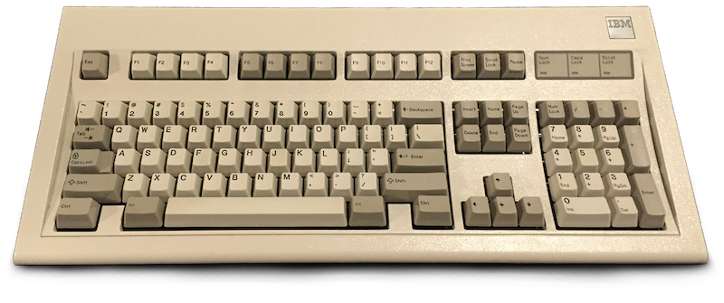
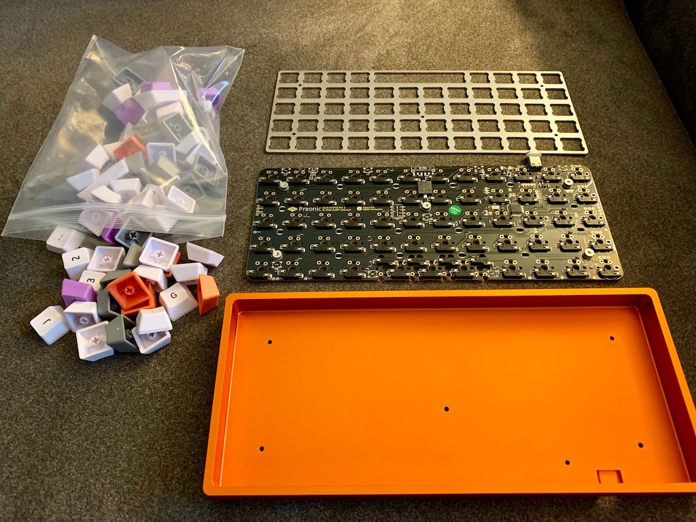
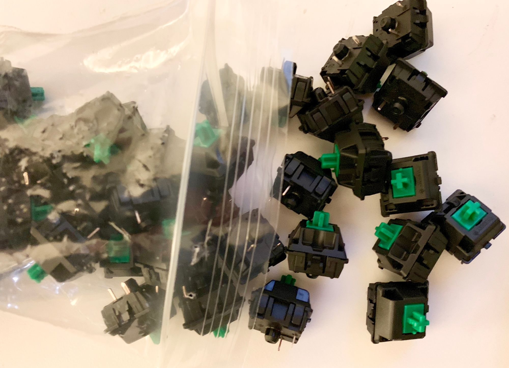
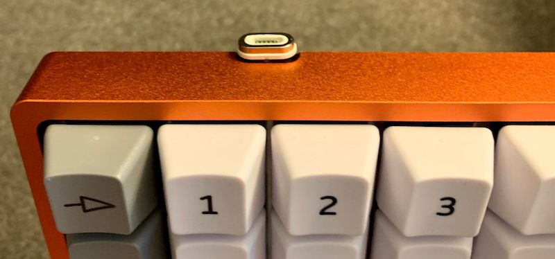

One of the first keyboards I used for my home computer was an IBM Model M. It might have been the first, but my memory is a bit foggy on the particulars. I do know that I managed to pick up three or four of the things from the University auction around the time I got my first computer (yes, I was a late arrival to the whole *computer thing*, but that's a story for another time).

I really liked the solidness of the keyboard, and the audible clickiness of it. Having learned on an electric typewriter (the thing with the hard to press keys and the spinning metal ball that smashed against the paper), I think part of my typing "skill" is inexorably linked to banging on the keys and hearing an accompanying "thunk" sound. While nothing matches the mechanical brutalness of an electric typewriter, the Model M came pretty close within the context of computer keyboards. Things worked out well for a long time, and then came the age of USB.

Initially, it wasn't a big deal since I assembled my own computers, and getting a good motherboard with both USB and PS2 connectors was easy to do. Eventually, however, the PS2 connectors vanished. Even then, things were okay for a while, as I was able to use a USB -> PS2 adapter. I'm not sure when it happened, but somewhere along the way the drivers for keyboards stopped playing nicely with my Model Ms. I went to far as to get a USB [Unicomp](https://pckeyboard.com) keyboard. Even though it used buckling spring switches just like the Model Ms, it wasn't the same.

Eventually wireless keyboards arrived, and I kept trying to fill the gap left by the Model M with various conveniences and niceties. All of these attempts worked out decently, for a while. Perhaps the best mixed bag was when I used the [Happy Hacking Keyboard](https://www.pfu.fujitsu.com/en/products/hhkb.html). I really adored the size, the Caps Lock key was replaced with Control, and it funtioned as a USB hub. Keeping the box it came in, I packed it around from work to home, and everything worked well. The biggest issue were the switches. It was a traditional membrane keyboard, so while the keys were of good quality there was just no getting around the general mushiness of the keys. Eventually some of the keys started to misregister, and I would get a combination of missed keys and errant key repitition. I ended up getting a second HHKB, but it was really just a stopgap until I found something else.

Next came the wilderness years of trying all kinds of different keyboards. Having switched to laptops, I just resigned myself to "okay, but kind of yuck" keyboards. The MacbookPro keyboards weren't the worst, and they seemed to handle my heavy handed typing style, so I figured that was what I was stuck with. When I switched away from a laptop for my personal machine, I even got one of the wireless Apple keyboards, as it had the same feel as my work laptop, and things were fine for a long time.

Somewhere along the way I heard about something called an `ortholinear` keyboard, which lead directly to the [OLKB](https://olkb.com) site. Not only was the idea of a keyboard with a grid layout interesting, but these keyboards looked like they might be the perfect blend of the HHKB and Model M keyboards that I'd been secretly wishing for. At the time of my discovering the site a new PCB was being formulated, so I put the notion of ordering one on the back burner.

The notion of getting an OLKB keyboard remained nestled in the back of my head for longer than I intended. As it turns out, that was a good thing. The new version of PCB had been completed, but there were a number of manufacturing issues that seemed to come one after another. Fortunately, by the time I revisited the issues were all resolved, but unfortunately there was a now a sizable backlog on the OLKB site. While I was wrestling with whether I should wait for the backlog to diminish before ordering, and whether I wanted a Planck or Preonic layout, a serendipitous moment occurred.

I had heard of [Massdrop](https://massdrop.com), but that was about it. As it happened a Preonic Massdrop had been started, stopped, and then restarted. By the time I noticed it only had one day left, but I was still able to snatch up a Preonic board with a set of [Acute](https://olkb.com/acute) keycaps and an aluminum case. I had been leaning towards getting a Preonic anyway, since I really didn't want to lose a dedicated number row. I suspect I would have gone with the Planck if that had been the Massdrop offering, though. The only parts missing were key switches, so the next step was to figure out what kind of switches I wanted and then go get them.

Harkening back to the Model M, I decided that I wanted to get some key switches with a little more resistance. In the realm of Cherry MX switches, that immediately shortened the list to Greens. I entertained the notion of going with Blues for a little while, but ultimately decided on Greens. The other advantage of the new PCB was the remarkable feature of hot swappable switches. All previous boards required switches to be soldered onto the PCB. In this case, if I ever wanted to swap out some or all the switches, it would just be an exercise of pulling the existing ones out and snapping new ones in.

The keycaps showed up first. I made sure to get some extras since there were some reports of bent leads if the switch wasn't properly aligned when pushing it into the socket. Also, like anything else, there's a chance of getting a bad switch. I ended up coming across one bad switch, but all the rest that I used worked great.

The day after the keycaps arrived, the rest of the parts showed up. It took maybe an hour to get everything assembled, including all the switches snapped into place. One of the last manufacturing issues with the PCB involved a lack of solder on the USB-C. This meant that it was possible, even likely, that exercising the port would end up pulling the while thing off the PCB. That is a situation that's not repairable since it pulls the connector right off the pads. The boards from the Massdrop were supposed to be "fixed", and when I inspected the legs of the USB-C port on my PCB I was able to see a small amount of solder. The USB-C port itself, however, is a bit of a tight fit, and I knew I'd always be nervous about it, especially since I was planning on packing this between work and home much like the HHKB from years before. The solution I decided on was to get a [magnetic USB-C cable](https://amzn.to/2FjRsA6). They are relatively cheap, and it means that I can leave the cabling hooked up at work and at home, and just pop off the magnetic piece from the keyboard.

But wait, there's more! The construction, flexibility of switches and keycaps, and typing feel of the keyboard is great, but in addition to that is the amazing [QMK Firmware](https://qmk.fm). It is a custom keyboard firmware that is used by many different keyboard types, and provides a level of functionality that just isn't seen. "Programable" keyboards that I've used in the past boil down to the ability to have some custom macros, and *all* of them are completely dependent upon OS level assistance. What I mean by that is any customization is saved on the OS, so if the keyboard is moved from one system to another none of the customizations follow it. Since QMK is firmware that gets written **directly to the keyboard** it travels with it.

In the case of the Preonic it's a small ARM chip that controlls the keyboard. As such, building the firmware involves cross compiliation. Under normal circumstances this can be a bit of a pain, but the QMK folks make even that a simple process. One of the build options, and the one I use, involves a Docker container that has all the relevant software installed. A utility script is provided that builds the Docker image, and runs it, dumping the finished firmware into the directory where it was run from. This all contained within the •[QMK Firmware GitHub repository](https://github.com/ttyS0/qmk_firmware/tree/my_preonic). There's only a few files that need updating to define your own keyboard layouts. All I did was fork the repository, and then make a branch, `my_preonic`, into which I put my configs.

I could go on for another few pages about the types of things one can do with the QMK firmware, but I'll leave that for another post. I've only gotten started on my customizations. I suspect I'll have many more adjustments until I settle on a set of layouts that are relatively stable.

I suppose this is a review of sorts. For me, the Preonic is the first time in many years that I've used a keyboard that not only has a typing feel equal to the Model M, but also has a collection of features that are exquisite enough to keep me exicited. So far the only downside is "regular" keyboards now feel a little odd. When I end up using my laptop away from my desk, or use my iPad's keyboard, it takes me a little while to adjust back to the slanted keyboard and remember that I need to type out more things since my cool macros don't exist. It's a minor annoyance, and also is a little reminder of just how great the Preonic is. 😎
