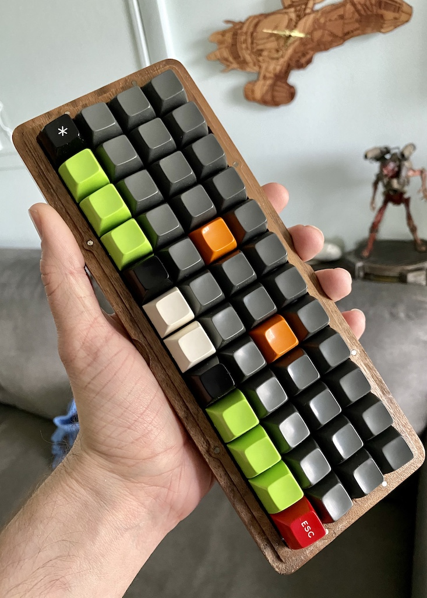
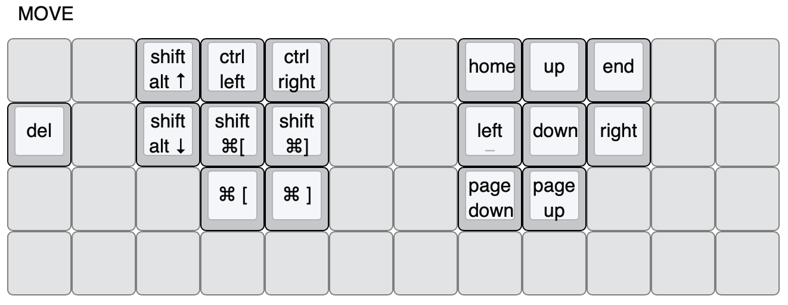

About a year ago I shifted to a new type of mechanical keyboard:



It was a MassDrop buy and my first `ortholinear` style keyboard. I took to it immediately, and it wasn’t long before I started thinking about ways to make it better. This is, of course, one of the dangers of stepping into the world of customized keyboards. There are a million different things to try and buy. In my case I ended up with both a new keyboard and a new layout.

##  The Planck

[The Planck](https://olkb.com/planck) is exactly like the [Preonic](https://olkb.com/preonic) except it’s missing a row, having 48 instead of 60 keys, assuming a full grid layout. When considering that maybe I didn’t need a dedicated number row it was trivial to do a trial run. As with most things it’s easier to pare down than build up. All that was needed was to turn each key in the number row into a no-op, and move the numbers to a layer of the first row above the home row. That way if the layout was unwieldy all that was needed was to load the keyboard with the previous configuration, and all would be well. As it turned out, after about a week I found myself not missing the number row at all. One of the advantages of an ortholinear layout is ones fingers only have to flex at the knuckle to change rows, at opposed to flex and reach with a traditional staggered layout. By not having a number row, the fingers only have to flex one row up or down from home. Once I got used to is, I found it to be a very comfortable arrangement.

Now that I was reasonably assured that I was ready for a Planck, I ordered it, and started the waiting process. In the meantime I started to think about what switches, keycaps, and case I wanted to use. All of those decisions, other than the case were heavily dependent on the keyboard layout I wanted to use. In case the shift to ortholinear key layout proved to be jarring, I had kept the QWERTY keyboard layout that I was used to, and had been using almost daily for the past thirty years or so. I had always been interested in alternate layouts like DVORAK, but never had an easy way to try them out, so I set about researching.

In the meantime I recalled seeing a wooden case somewhere and eventually rediscovered [Datamancer](https://datamancer.com/product-category/?catid=/keyboardcases/). There was a little bit of a lead time for a Planck case, but I went ahead and ordered it anyway. It would still be arriving long before the Planck. I had already been packing my Preonic back and forth from work, so having a case with a lid was going to be a nice addition.

##  COLEMAK

As I looked into the DVORAK layout it became clear that it didn’t look like a good fit for me. While I don’t categorize myself as a programmer, I do spend a lot of time in [an IDE](https://www.jetbrains.com/idea/) and [terminal](https://iterm2.com/). As a result, having the `z x c v b` keys scattered about the keyboard relative to their QWERTY placements becomes a non-trivial hardship. This is where [COLEMAK](https://colemak.com/) came in. Not only does it preserve those key locations (only 17 keys are moved from a QWERTY layout), but it’s also optimized for finger travel. Combining that approach with an ortholineal layout seemed like the best approach. Though I considered switching the Preonic to COLEMAK while I waited for the Planck to arrive, I decided to wait. For changes like this I tend to do better with the “big bang” approach, so my plan was to switch to the Planck and to COLEMAK in one shot.

##  Switches

The next item to tackle was that of key switches. My favorite remains the [IBM Model M buckling spring](https://en.wikipedia.org/wiki/Buckling_spring), but it only exists as a component of Model M (or Model M clone) frames. When I got my Preonic I guessed that I would like [Cherry MX Greens](https://www.cherrymx.de/en/mx-special/mx-green.html) the best. As it turns out I found their resistance to be just a little more than I liked. I tend to be a heavy typer, but I suppose years of using laptop and membrane keyboards have lightened my touch a little. Perhaps I’m just getting old 😬. I did, however, really like the clickiness of the MX Greens, so I decided to go with [Cherry MX Blues](https://www.cherrymx.de/en/mx-original/mx-blue.html). They are basically the same as the MX Greens, but have roughly a quarter less resistance. There are many places to get key switches from. I’ve had great experiences with [Mechanical Keyboards](https://mechanicalkeyboards.com/shop/index.php?l=product_list&c=107), so they’re my default place to go. They’re also roughly local to me, so it’s nice to give some support to a local business. The switches come in packs of 10, and I highly recommend adding an extra pack on top of the number you actually need. So far the only problems I’ve had have been self inflicted, but it’s nice to have some spares around in the event that one or more need to be replaced.

##  Keycaps

At this stage I had lined up the Planck PCB & Plate, a wooden case (with magnets even!), a new keyboard layout (COLEMAK), and switches (Cherry MX Blues). The only major component left were the keycaps. While I had been using my Preonic I had been gathering various types and styles of keycaps. It’s a relatively painless process to swap them out, and they’re not so expensive to preclude buying a bunch of different kinds just to find out which types you’re best suited towards.

My original Preonic had come with the OLKB designed `acute` keycap set. Something to note with keycaps is there are even more style variations than with key switches. The acute keycap set is referred to as “OEM”, which means there is some sculpt to the keys and they are somewhat short. [This is a great illustration of the various keycap profiles out there.](https://i.imgur.com/kFxqOm8.jpg) In practice some of the terms shown are shortened in regular use. For example, while `Signature Plastics` developed the SA profile, so it’s technically the “SP SA” profile, in commonly referred to as SA. The same goes with DSA, and DCS. While I liked the sculpt of the acute keycaps, I found it a little too subtle, and the plastic used, `PBT` has a slight sandy texture to it that I wasn’t a fan of.

After trying out many different profiles and plastic types, I came to discover that my favorite was sculpted SA with ABS plastic. Even with that decision out of the way there was another to make. Sculpted keycaps have [row designations](https://pimpmykeyboard.com/template/images/SAFamily.pdf), and there are a multitude of different arrangements possible, though most of them are easy to work out. When it came to the Planck I only had four rows to deal with. The home row was definitely going to be R3, which is horizontally level. This made the rows above and below the home row easy to decide as R2 and R4, respectively. R2 and R4 keys have a 7 degree slant to them. Technically they’re the same keycap, since if you have an R2 and want to use it as an R4 all you have to do it flip it around so the slope goes the opposite direction. This left the bottom row, which took a little bit longer to figure out.

It’s common to have the bottom row, which is used primarily by the thumbs and little fingers, use an R3 (horizontally flat) keycap. I think the idea is this provides some tactile differentiation since the R4 slopes up and makes a natural drop off to the R3. In practice I found that to not be enough. I found my thumbs inadvertently reaching up to the R4 row which causes all kinds of headaches. For me, the solution was to take R1 caps, which are the tallest SA keycaps and have a relatively steep 13 degree slope, and place them on the bottom row. I also flipped them around, so the slope rose up towards the R4 row. This acts as strong signal to my thumbs so stay put on the bottom row, and provides an extremely tactile element for any fingers that need to reach down. Basically, my little fingers just curl down, and I press the bottom keys with the the top knuckle of my little finger. It sounds strange, but it’s quite comfortable for me.

And perhaps this is one of the reasons that people, like myself, who like custom keyboards can come off as rather … intense. The whole process of getting a custom keyboard is exceedingly custom. It’s not just that the keyboard itself is custom, but it is heavily customized to the owner. Most of the difficulty comes from figuring out which things are really best for you. Reviews and comment sections full of “THIS is the BEST” are only useful in so far as they expose possibilities. It’s extremely unlikely that anyone can take somebody else’s custom keyboard with an associated custom layout and have it be a great fit for them. Nobody decides to go the custom keyboard route because they’re trying to cut costs. Realize that part of the expense of going this route is there will be many components that need to be purchased just to find out what things you don’t like.

With the keycap decision set (sculpted ABS SA R2-R3-R4-R1), the next decision was to figure out what colors and/or labels I wanted. The latter was the easiest decision. Since I was going to be switching to a different keyboard layout it was essential that I use blank keycaps. I was a touch typist with QWERTY, and didn’t want to learn COLEMAK by creating a new habit of looking down at the keys. And I like a little bit of flair, so why go with white keycaps when you can be a little more stylish. Unfortunately sculpted SA keycaps can be a little hard to come by, especially in blank sets. I’ve found Oh, Keycaps to be the most reliable when it comes to having shippable stock. Recently they’ve also gotten some more color variety, which is nice to see. I went with a Grey/Orange scheme, though I have since modified that further. Keycaps are the easiest thing to switch out, so I tend to do just periodically.

## Assembly

With everything figured out and ordered the hardest part was to follow. WAITING! Since I was getting every component from different vendors, and since all of this stuff is varying degrees of niche, none of it has the instant gratification of Amazon ordering of clicking a button and having that thing show up either the same or next day. The Planck PCB was the last item to arrive, and it only took a few months, which was actually faster than anticipated due to the significant backlog that had built up both from high demand of the new [REV6 board](https://olkb.com/planck/pcb) and some initial manufacturing issues.

Once everything arrived it was a relatively quick process to put everything together. The Planck PCB sits on the bottom of the case, with some shallow standoffs. Additional standoffs hold the metal plate that the key switches snap into just above the PCB. Screws go up from the bottom of the case to the metal plate, and hold everything tightly together so it feels like a single unit. Next, the switches are pushed down into the plate. Their metal prongs snap into the hot-swappable sockets that were one of the most significant additions to the REV6 boards. Previously switches would need to be soldered in place, and while I’m not against some light soldering it’s exceedingly nice to not have to. Once the switches are snapped in, the keycaps are pushed onto the switch stems, and `TA DA` the keyboard is assembled!

## Muscle Memory Is Strange

After getting the Planck together, I loaded basically the same layout that I had been using on the Preonic, except the for the 17 key rearrangement that turns QWERTY into COLEMAK, and switched over. The first week or so was real rough. It was a great example of just how much optimization is put in place for what we think of as “muscle memory” activities. When every letter has to include a conscious thought about where that letter is and a conscious effort to move the appropriate finger to that location, even the simplest sentences become excruciatingly slow and tedious. This molasses effect lasted for everything for a full week or so. After that a few words collections, like `the` and `and` were clicking into place, so instead of an entire thought feeling like it took a small eternity to type, it shifted into a lurching hulk. After a month or so I took down the visual aid of the keyboard layout that I had taped to my wall (that was a technique that was extremely effective in high school typing class, and was very useful for my now much older brain). My speed was roughly half of QWERTY, but I thought half speed after a few weeks of a completely new layout was pretty good considering I’d been practicing QWERTY almost daily for practically three decades.

It was amusing to discover some of the nooks and crannies that the QWERTY muscle memory still lingered. It seemed to be very application specific. For example, I don’t use `VIM` very much anymore, but it’s still my default for editing of text files on remote Linux boxes. I fired up VIM to do a basic modification of a text file, and gobbley gook was all that issued from my fingers. It was like some section of my brain reached over and loaded in the VIM brain module which hadn’t yet been trained on any of the new COLEMAK stuff. Little tidbits like that lingered on for another month or so.

## COLEMAK++

By the third month I was close to my QWERTY speed, and feeling very comfortable with COLEMAK. About that time is when I started to think about smoothing out some of the other awkwardnesses in my keyboard layout. When I switched over, I only changed the alpha layout, keeping the layers and symbol arrangements the same. I wanted to get used to COLEMAK so I could better decide whether anything needed to be done about both the layers and the edge keys.

When I was researching different keyboard layouts I ran across a blog post by Callum Oakley titled [48 keys are plenty](https://callumoakley.net/posts/48-keys-are-plenty). Not only was it an illuminating post for me at the time, but it pointed me to his GitHub repository where he stored his [QMK](https://qmk.fm/) layout for his Planck. He has a very opinionated take on layer layout, and one that I found very intriguing. Since it was also COLEMAK, the only changes for me were in the layer and edge keys, which I was already puzzling over anyway. After some thinking, I decided to give his approach a try. The thing that stood out the most was the reordering of number keys to favor the use of the strongest fingers. It took a little bit of getting used to, but after a day or two I was converted.

I stuck with a straight copy of Callum’s config for a couple of weeks, and then started to make note of some of the areas that seemed awkward to me. The beauty of this whole system is the ability to use an already established config as a baseline and then adjust and configure it as much as needed. Today, my layout looks like this:

I haven’t made any significant changes for a few months now, though there are still a few places that feel a little rougher than they should be. I like to think of it as using super fine grit to polish a stone. It may be pretty smooth already, but every now and again you finger slides over a spot that has a slight roughness to it. With something like a keyboard layout those little spots never truly go away. Instead, they just move around. And that’s also part of the fun. As you change so can your keyboard. In that sense it starts to feel a little more like a familiar than just an input device. To me, the combination of the Planck and QMK are a perfect example of sufficiently advanced technology that it feels like magic. 😎
